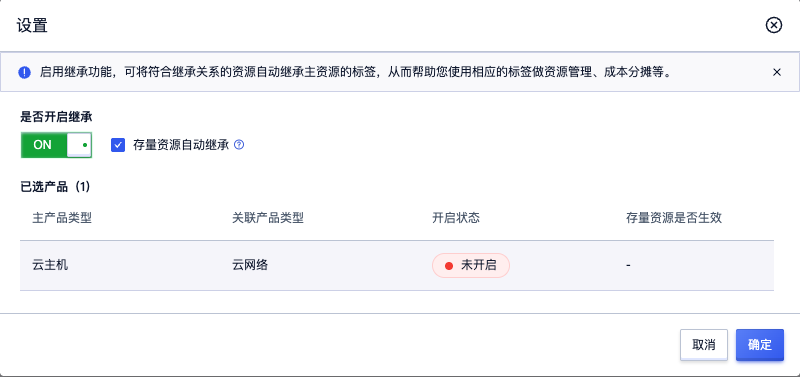
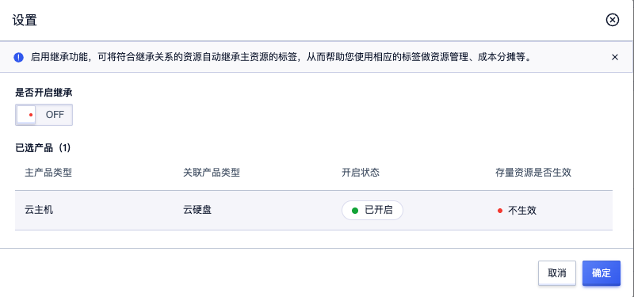

# 关联标签继承
您可以使用关联标签继承功能，当主资源标签变更或与关联资源建立联系时，关联资源会自动继承主资源的标签，提升运维效率。例如：为云主机UHost实例绑定标签时，其关联的云盘、弹性网卡和弹性公网IP也会自动绑定该标签；后续新增关联资源时也会自动继承该标签。

## 一、使用限制
- 本功能支持的资源类型列表，请参见支持关联标签继承功能的资源
- 当您启用并设置关联资源标签继承规则后，如果设置继承的标签键与关联资源已存在的标签键同名，系统有可能覆盖关联资源已存在的标签。例如：关联资源原本绑定标签```cost:hangzhou```，主资源绑定标签```cost:shanghai```，设置规则关联资源可继承主资源的标签cost，则关联资源标签```cost:hangzhou```将被覆盖为```cost:shanghai```。

## 二、基本操作

#### 启用关联标签继承功能
1. 访问**关联标签继承**页面。
2. 在**关联标签继承**页面，单击目标资源类型**操作列**的**设置**按钮。
3. 在**设置**对话框，点击开启继承按钮至**ON**，然后单击确认
  - 生效存量资源：启用后，改规则也会对存量资源生效


#### 关闭关联标签继承功能
> **温馨提示**：关闭关联标签继承规则后，关联资源将无法自动继承主资源标签，可能影响您通过标签做资源管理、成本分摊等。

1. 访问**关联标签继承**页面。
2. 在**关联标签继承**页面，单击目标资源类型**操作列**的**设置**按钮。
3. 在**设置**对话框，点击关闭继承按钮至**OFF**，然后单击确认


#### 批量设置
您可以在**关联标签继承**页面，选中多个资源后，批量设置。

## 三、支持关联标签继承功能的资源

| 父资源类型 | 子资源类型 |
| --- | --- |
| 云主机(Host) | 普通云盘(Standard UDisk) |
|  | 弹性IP(ElasticIP) |
|  | 云硬盘系统盘(System Disk) |
|  | SSD云盘(SSD UDisk) |
|  | RSSD云盘(RSSD UDisk) |
|  | 经济型SSD云盘(SSD Essential) |
| 容器云(UK8S) | 云主机(Host) |
|  | 物理主机(PHost) |


